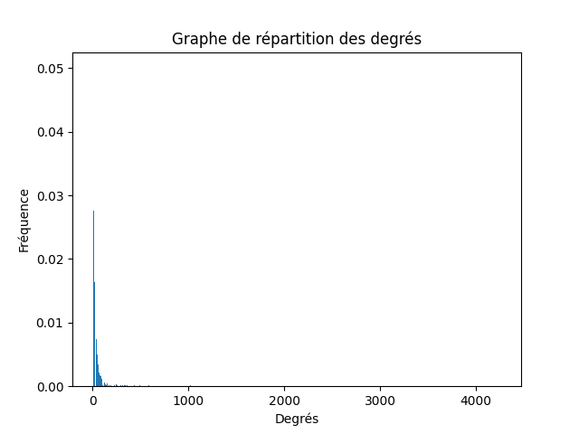

# Webgraph study



The goal is to calculate parameters for certain graphs :

- barabasi-albert graphs
- edgar-gilbert graphs
- graphs from the stanford database (from the web)

```
# Generate random graph
python3 __main__.py graph <eg|ba>

python3 __main__.py graph eg
# Graph containing edges will be saved under resources/
```

```
# Generate plot from a set of edges
python3 __main__.py plot <filepath>

python3 __main__.py plot resources/twitchDE.csv
# Plot will be saved under data/plots/
```


## Tests

```
export PYTHONPATH='.'
python3 tests/test_graph.py
```

## Dependencies

Python 3.8.5

Matplotlib 3.3.3

## Notes

To replace all tabs by commas in the file RoadNetwork.txt
```
cat resources/RoadNetwork.txt | sed 's/^\(..*\)\t\(..*\)/\1,\2/g' > RoadNetwork.csv
```

